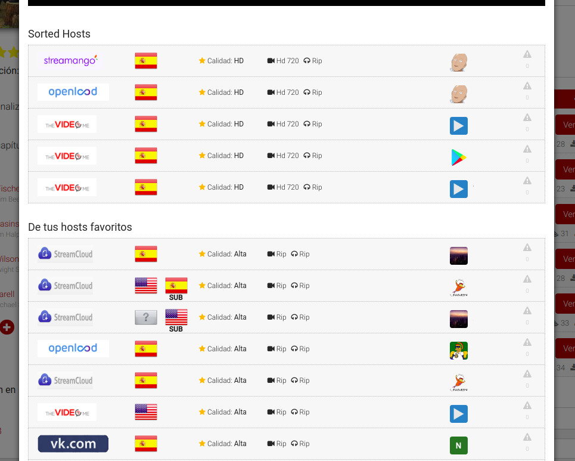

# Plusdede Link Sort
Sort Plusdede links with this awesome Chrome extension!

  

## What (does this extension do?)
It sorts the displayed links by quality, language and subtitles.

## Why?
Plusded doesn't provide any sorting function. I do.

## Install instructions

#### Chrome Store
* Go to [Chrome Store link](https://chrome.google.com/webstore/detail/plusdede-link-sort/kgenjfcceemhklklbfahkkepmfppkpao)
* Install

#### Release
* Go to [realeases](https://github.com/iAbadia/PlusdedeLinkSort/releases)
* Download newest binary (Yes, that .crx file)
* Drag and drop into chrome

#### Developer
* Go to 'chrome://extensions'
* Activate developer mode
* Download or clone this repo
* Load uncompressed extension
