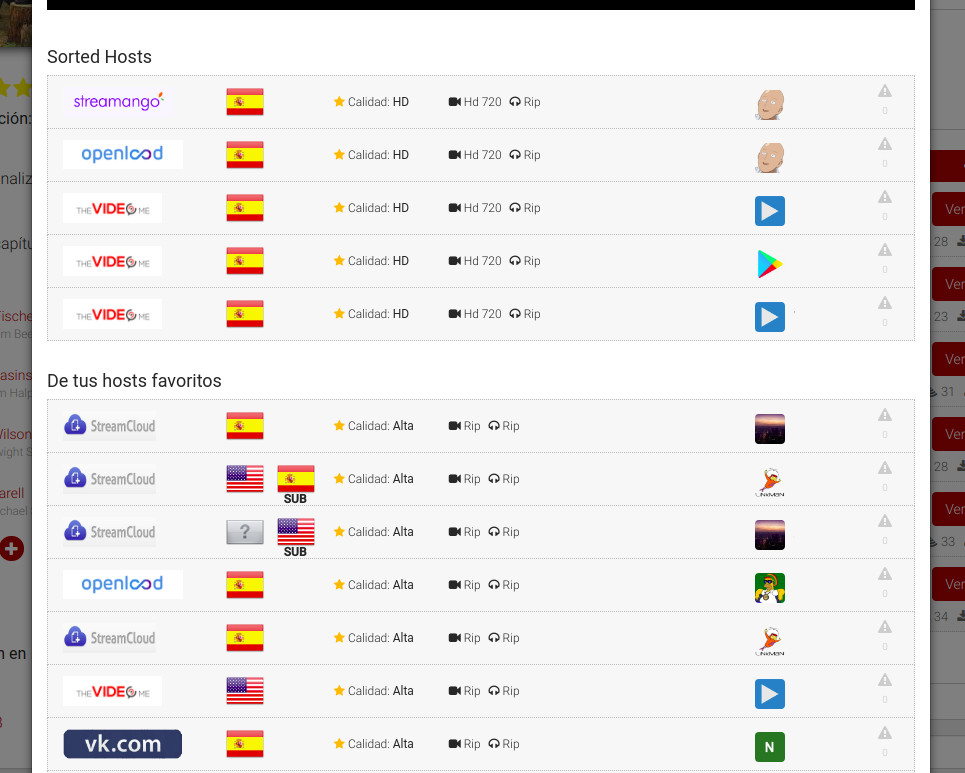

# Plusdede Link Sort
Sort Plusdede links with this awesome Chrome extension!

  

## Why?
Plusded doesn't provide any sorting function. I do.

## What (does this extension do?)
It sorts the displayed links by quality. As of now, HD quality is hardcoded. Plans for the future include showing an interactive dropdown list for sorting by language, subtitles, quality and user.

## Install instructions
#### Release
* Go to [realeases](https://github.com/iAbadia/PlusdedeLinkSort/releases)
* Download newest binary (Yes, that .crx file)
* Drag and drop into chrome

#### Developer
* Go to 'chrome://extensions'
* Activate developer mode
* Download or clone this repo
* Load uncompressed extension
