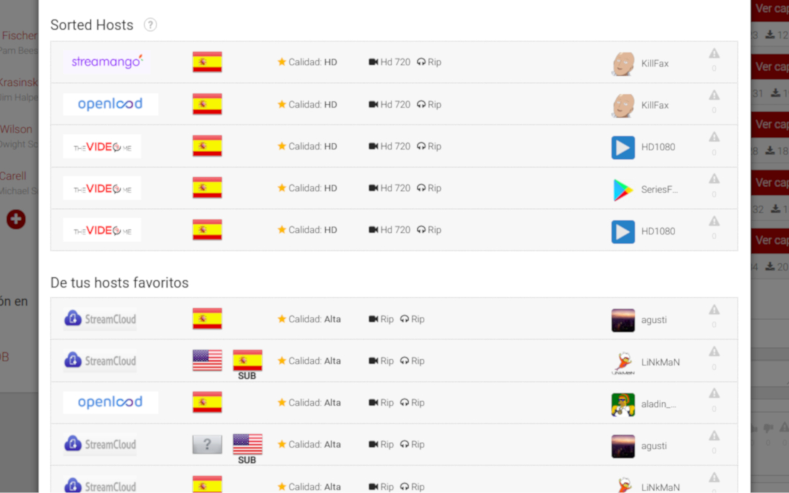

# Plusdede Link Sort
Sort Plusdede links with this awesome Chrome extension/Firefox addon!

  

## What (does this extension do?)
It sorts the displayed links by quality, language and subtitles.

## Why?
Plusded doesn't provide any sorting function. I do.

## Install instructions for Chrome

#### Chrome Store
* Go to [Chrome Store link](https://chrome.google.com/webstore/detail/plusdede-link-sort/kgenjfcceemhklklbfahkkepmfppkpao)
* Install

#### Developer
* Go to `chrome://extensions`
* Activate developer mode
* Download or clone this repo
* Load uncompressed extension

## Install instruction for Firefox

#### Firefox Addons
* Go to [Firefox Addon link](https://addons.mozilla.org/firefox/addon/plusdede-link-sort/)
* Install

#### Developer
* Download or clone this repo
* Go to `about:debugging`
* Click on `Load Temporary Add-on`
* Select `manifest.json`